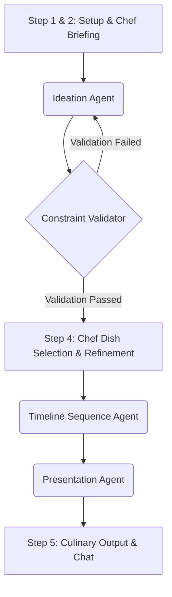

# 🍳 Code to Cuisine — AI Culinary Engine


Code to Cuisine is an advanced, Human-in-the-Loop (HITL) culinary assistant designed to transform a random assortment of pantry ingredients into Michelin-star-worthy dishes. Built on a sophisticated 4-agent **LangGraph** architecture and powered by **Groq**, this application guides users through a 5-step interactive wizard, handling everything from ideation and validation to complex kitchen timelines and plating aesthetics.

---

## ✨ Features

- **Human-in-the-Loop (HITL) Workflow**: Checkpoints allow the "chef" (user) to inject preferences, swap ingredients, and guide the AI's creative process before finalization.
- **4-Agent Architecture**:
  - 🧠 **Ideation Agent**: Generates creative dish options using selected pantry items.
  - ⚖️ **Constraint Validator Agent**: Strictly ensures recipes adhere to dietary restrictions and only use available ingredients.
  - ⏱️ **Timeline Sequence Agent**: Develops a highly structured 60-90 minute kitchen execution plan.
  - 🎨 **Presentation Agent**: Crafts aesthetic plating guides and compelling culinary pitches.
- **Stateful Memory**: Utilizes `MemorySaver` checkpointing to maintain context throughout the workflow.
- **Interactive Chat Assistant**: A context-aware chat interface allows you to ask targeted questions about your generated recipe (e.g., flavor science, plating, timeline).
- **Strong Typing**: Pydantic models strictly enforce the structure of the AI's output, ensuring reliable JSON parsing for the UI.

---

## 🏗️ Architecture

The application orchestrates the following AI pipeline using **LangGraph**:



### Key Components

- `app.py`: The main Streamlit entry point. Manages the wizard UI and session state.
- `models.py`: Pydantic schemas (e.g., `RecipeState`, `CulinaryOutput`) that strictly define the data flowing through the graph.
- `src/services/workflow_service.py`: Orchestrates the LangGraph StateGraph, compiling the 4 agents into two distinct execution phases (Phase 1: Ideation/Validation, Phase 2: Timeline/Presentation).
- `src/agents/`: Contains the specific prompt logic and LLM bindings for each of the four specialized agents.

---

## 🚀 Getting Started

### Prerequisites

- Python 3.9+
- A [Groq API Key](https://console.groq.com/keys)
- *(Optional)* A [Tavily API Key](https://tavily.com/) for online search capabilities.

### Installation

1. **Clone the repository**:
   ```bash
   git clone https://github.com/AIDA-DEV-TEAM/Code_to_Cuisine.git
   cd Code_to_Cuisine/Recipe-AI-Easy-Recipes
   ```

2. **Set up a virtual environment**:
   ```bash
   python -m venv venv
   source venv/bin/activate  # On Windows use `venv\Scripts\activate`
   ```

3. **Install dependencies**:
   ```bash
   pip install -r requirements.txt
   ```

4. **Run the application**:
   ```bash
   streamlit run app.py
   ```

### Configuration
You can input your Groq API key directly into the Streamlit sidebar once the application is running.

---

## 🧑‍🍳 Usage: The 5-Step Wizard

1. **Step 1: Setup**: Select your available pantry ingredients, culinary appliances, dietary restrictions, and cooking skill level.
2. **Step 2: Chef Briefing**: Provide pre-ideation notes. Want to highlight a specific ingredient or technique? Tell the AI here.
3. **Step 3: AI Generation**: The Ideation and Validator agents generate three viable dish options.
4. **Step 4: Choose Dish**: Review the flavor profiles and select your favorite. You can refine the choice by swapping or removing ingredients.
5. **Step 5: Final Recipe**: The Timeline and Presentation agents finalize the dish, providing a step-by-step execution plan, plating guide, nutritional info, and a competitive culinary pitch.
6. **Bonus - Chat**: Use the integrated chat module to ask the AI questions about your new recipe!

---

## 🛠️ Technology Stack

- **Frontend**: [Streamlit](https://streamlit.io/)
- **LLM Orchestration**: [LangChain](https://www.langchain.com/) & [LangGraph](https://langchain-ai.github.io/langgraph/)
- **Inference**: [Groq](https://groq.com/)
- **Data Validation**: [Pydantic](https://docs.pydantic.dev/)
